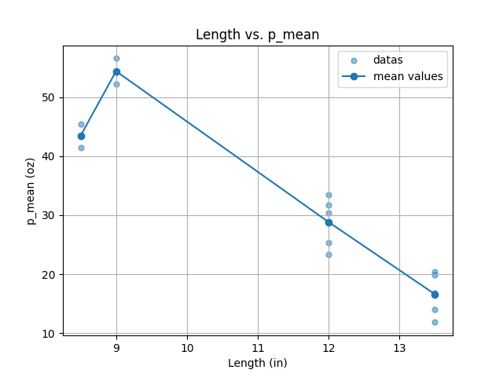
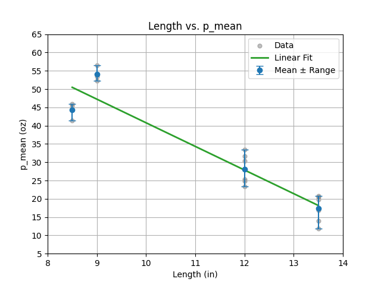

# ENG EK 301: Engineering Mechanics 1
Boston University  
Taught by Professor Gregory McDaniel in Fall 2025.  
<b>Contributor:</b> Jungjae Lee (jungjae@bu.edu), Jacky Lin (jlin06@bu.edu), Adam Mhal (adammhal@bu.edu)


## Course Description
Fundamental statics of particles, rigid bodies, trusses, frames, and virtual work. Distributed forces, shear and bending moment diagrams. Application of vector analysis and introduction to engineering design. Includes design project. ([description](https://www.bu.edu/academics/eng/courses/eng-ek-301/))


## Initial Setup
Install the necessary dependencies and set up environment.
```bash
sudo apt install python3-pip
python3.10 -m venv mechanics
source mechanics/bin/activate
pip install pandas matplotlib openpyxl
```


## 1. Buckling Lab Report
### 0. Overview
In this project, we aim to explore the buckling behavior of acrylic strips under compressive loads to understand how the strip length affects the critical buckling load. By conducting multiple tests on strips of different lengths, we hope to develop a model that can predict the buckling load for various strip sizes.

### 1. Free Body Diagram of the Loaded Acrylic Strip
```bash
python3 buckling_FBD.py
```

### 2. Buckling Load Analysis with Mean Values
The first plot shows the relationship between strip length and the measured critical buckling load. It visualizes the raw data and overlays the mean values for each length.



Run the following command to generate the plot:
```bash
python3 buckling_analysis_1.py
```

### 3. Buckling Load Analysis with Linear Fit
The second plot also shows the relationship between strip length and critical buckling load, but this time it adds a linear regression line fitted to the mean values and includes error bars to show the standard deviation of the measurements.



Run the following command to generate the plot:
```bash
python3 buckling_analysis_2.py
```